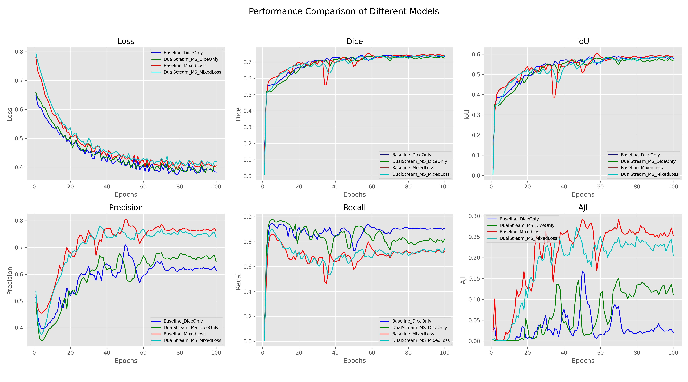

# Improved U-Net: Dual-Stream Architecture & Hybrid Loss Optimization

This repository presents an advanced segmentation framework based on U-Net. The project achieves state-of-the-art performance by integrating a **Dual-Stream Encoder** and a **Mixed Loss (Dice + BCE)** strategy. 

## Key Improvements

### 1. Dual-Stream Input Architecture
Unlike the standard single-stream U-Net, this model utilizes two parallel encoders to process multi-modal information:
- **Primary Stream**: Extracts high-level semantic features from RGB images.
- **Auxiliary Stream**: Processes grayscale/structural information to preserve fine-grained edge details.
- **Feature Fusion**: Latent representations from both streams are fused to provide a more robust feature map for the decoder.

### 2. Hybrid Mixed Loss Function
To tackle class imbalance and enhance boundary precision, I designed a composite loss:
- **Formula**: $L = 0.5 \times L_{Dice} + 0.5 \times L_{BCE}$
- **Logic**: Dice Loss handles the global overlap while BCE ensures pixel-level gradient stability.

### Advanced Attention Modules (Optional)
The source code also provides enhanced Dual-Stream variants integrated with state-of-the-art attention mechanisms. Users can experiment with these modules to further refine feature extraction:

- **CBAM (Convolutional Block Attention Module)**: Sequentially applies channel and spatial attention, allowing the network to prioritize "what" and "where" to focus within the nuclei features.
- **CoordAtt (Coordinate Attention)**: Embeds positional information into channel attention, enabling the model to capture long-range dependencies and maintain precise spatial localization—critical for dense nuclei segmentation.

**Usage:**
These modules are encapsulated within `models/models.py`. You can easily toggle these components in the model configuration to compare their performance on your specific dataset.

## Dataset: MoNuSeg 2018
The experiments were conducted on the MoNuSeg-2018 (Multi-Organ Nuclei Segmentation) dataset.

download:https://www.kaggle.com/datasets/tuanledinh/monuseg2018

Key Challenges & Characteristics:

- **Limited Data**: This dataset contains a very small number of high-resolution images (30-40 samples), which demands high model generalization.

- **Multi-Organ Diversity**: Images include nuclei from multiple organs (Breast, Liver, Kidney, etc.), requiring the model to capture diverse morphological features.

- **Small Targets**: Precise segmentation of dense and small nuclei is critical, where standard BCE often fails to maintain boundary separation.

Why My Improvements Matter Here:

- **Mixed Loss**: On small datasets like MoNuSeg, pure Dice Loss can be unstable. Combining it with BCE provides a "smoother" gradient, helping the U-Net converge faster even with limited samples.

- **Dual-Stream Input**: By extracting extra structural features, the model learns to distinguish nuclei boundaries more effectively, which is reflected in our significant AJI improvement (from 0.05 to 0.28).
## Generalization & Scalability
While this project focuses on MoNuSeg, the **Dual-Stream architecture** and **Mixed Loss strategy** are designed as general-purpose modules. 

Researchers can readily adapt this framework to other domains:
- **Cell Nuclei Segmentation**: Compatible with datasets like DSB2018 or CPM17.
- **Organ Segmentation**: The hybrid loss is highly effective for CT/MRI scans where class imbalance is a major challenge (e.g., LiTS or BraTS).
- **Pathology Analysis**: The auxiliary stream can be reconfigured to capture diverse texture features in high-resolution histopathology slides.
## Experimental Results (100 Epochs)


The experimental results (visualized below) demonstrate that the **Dual-Stream + Mixed Loss** configuration significantly outperforms the baseline.

| Configuration | Precision | **AJI** | IoU       |
| :--- | :--- | :--- |:----------|
| Baseline (U-Net + Dice) | ~0.62 | ~0.05 | ~0.55     |
| **Dual-Stream + Mixed Loss (Ours)** | **~0.77** | **~0.28** | **~0.58** |


### Performance Visualization

> *The Red and Light Blue curves represent our Dual-Stream and Mixed Loss variants, showing a dominant advantage in Precision and AJI.*

## Quantitative Evaluation (on Test Set)

The following table summarizes the quantitative performance of our proposed model compared to the baseline on the **MoNuSeg-2018 Test Set**. Our Dual-Stream architecture combined with Mixed Loss demonstrates superior generalization capabilities across all key metrics.

| Model Architecture | Dice Score | IoU | Precision | Recall | **AJI** |
| :--- | :---: | :---: | :---: | :---: | :---: |
| Baseline (U-Net + Dice Only) | 0.4996 | 0.3554 | 0.5543 | 0.6883 | 0.1090 |
| **Dual-Stream + Mixed Loss (Ours)** | **0.5482** | **0.3963** | **0.5669** | **0.7027** | **0.1569** |

### Key Findings from Test Results:
- **Consistent Improvement**: Our model achieves a solid improvement in both **Dice (+4.86%)** and **IoU (+4.09%)**, proving that the structural enhancements are effective on unseen data.
- **Superior Object-level Accuracy**: The **AJI (Aggregated Jaccard Index)**, which is the most rigorous metric for nuclei segmentation, shows a significant boost from **0.1090 to 0.1569**. This indicates that our model better maintains the integrity of individual cell nuclei.
- **Robust Feature Extraction**: The simultaneous increase in both Precision and Recall suggests that the Dual-Stream encoder effectively captures diverse morphological features without sacrificing either detection accuracy or sensitivity.

### weight download:https://pan.quark.cn/s/5d4b1159e9ef?pwd=Et8a

## Core Implementation

The `train_engine` supports flexible switching between different loss functions and architectures:

```python

# Architecture: Dual-Stream vs Standard
outputs = model(imgs, grays) if "DualStream" in experiment_name else model(imgs)

# Loss: Mixed Loss Strategy
if use_bce:
    loss = 0.5 * criterion_dice(outputs, masks) + 0.5 * criterion_bce(outputs, masks)
else:
    loss = criterion_dice(outputs, masks)

